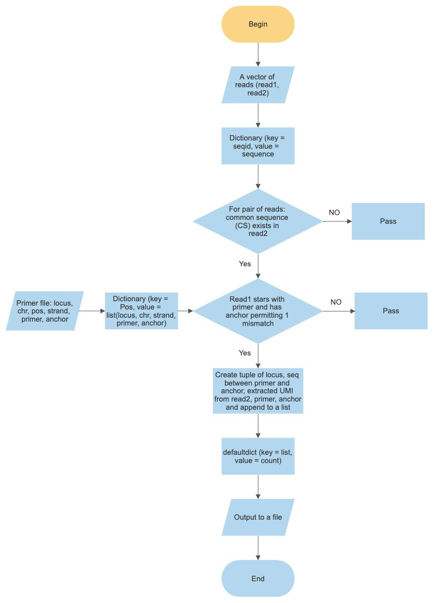

<!-- PROJECT TITLE -->
# UMI (Unique Molecular Identifiers)
UMIs for mixture interpretation

<!-- TABLE OF CONTENTS -->
## Table of contents
* [Introduction](#introduction)
* [Usage](#usage)

<!-- Introduction -->
## Introduction
The scripts are used to extract the DNA fragments containing STR sequence between gene specific primer and anchor sequence from paired-end fastq files. The DNA fragment composition is shown in figure 1. The 11 nucleotide (nt) long common sequence (CS) was used as a marker to identify the 12nt long UMI sequence from read2. Flowchart of the python implementation is represented in figure 2. 

<p align="center">

<p style="text-align: center;"><strong>Figure 1. </strong> An illustration of QIAseq DNA fragment composition. Read1 is in the order of locus-specific primer -> targeted DNA sequence -> common sequence in all reads -> unique molecular identifier while read2 begins with UMI followed by CS and targeted DNA sequence.
</p>


<p align="center">

<p style="text-align: center;"><strong>Figure 2. </strong> A representation of implementation of python script UMIscript.py. The inputs to this script are paired-end fastq files (read1, read2) and primer file(locus, chr, pos, strand, primer sequence, anchor sequence). The outputs are files for each sample with information about the targeted DNA sequence for a locus-specific primer along with respective UMI, anchor, and count.
</p>
</p>

<!-- Usage -->
## Usage

* Create a directory with all the sample fastq files.
* To this directory add a file that has primer sequence information along with locus, chr, genomic position, strand, and anchor sequence. This information will be used to pull the DNA fragment (containing STR sequence) between primer and anchor.

* Add path of this directory to the variable 'directory' in UMIscript.py
> directory = "path/to/directory/of/fastq/files"

* Add primer file name with path to the variable 'file_primer' in UMIscript.py
> file_primer = "path/to/primerfile/nameOfPrimerFile"

* UMIscript.py uses strfuzzy.py to search for anchor sequence with fuzzines. Default settings allow for fuzziness of a single nucleotide base. This setting can be changed by changing the numeric value of the variable 'fuzz' to desired fuzziness (the line of code is shown below). strfuzzy.py should be in the same directory where UMIscript.py is located.
> anchorIndex = strfuzzy.fuzzyFind(readR1, anchor, fuzz=\<numeric value of desired fuzziness\>)

* Save and run the python script
```
python3 UMIscript.py
```

UMIscript.py will loop through all the fastq files and create output files with information about locus, and their respecitve DNA fragment (containing STR sequence), UMI sequence, primer, anchor sequence, and the count of DNA fragment.
